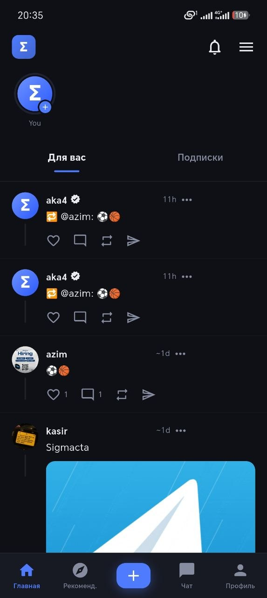
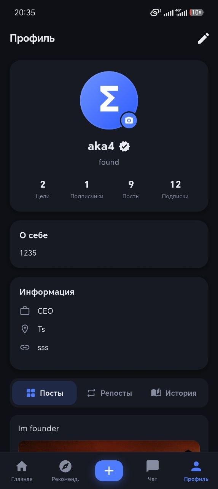
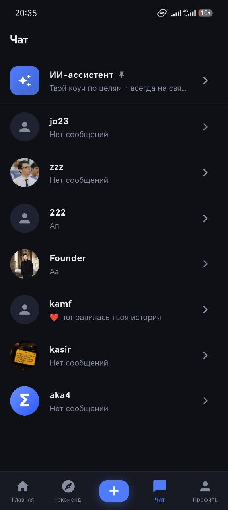
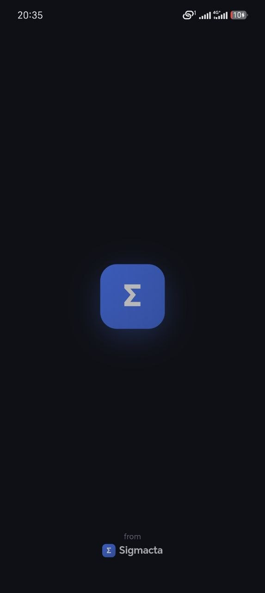
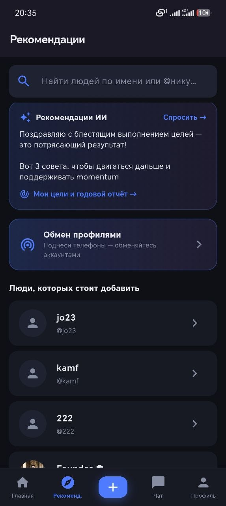

# Sigmacta — социальная сеть нового поколения для Центральной Азии

**Sigmacta** — полноценная социальная сеть без алгоритмической ленты: общение, сторис, бесплатная музыка/подкасты/аудиокниги, сообщества и личностное развитие (годовые цели + ИИ-коуч) в одном приложении. Вместо бесконечного скроллинга случайного контента — инструменты, которые помогают реально развиваться.

Продукт написан с нуля одним разработчиком: мобильное приложение на **Flutter** (Android + Web) и собственный бэкенд на **Node.js/Express + Supabase** с realtime-чатом, push-уведомлениями и ИИ-функциями.

> 📱 Клиент (этот репозиторий) · 🔗 Бэкенд: [sigma-social-backend](https://github.com/dzhakhann/sigma-social-backend)

---

## 📸 Скриншоты

<p align="center">
  
  
  
</p>
<p align="center">
  
  
</p>

<p align="center"><i>Лента · Профиль · Чат · Главная · Рекомендации</i></p>

---

## ✨ Возможности

**Общение**
- **Регистрация без email и телефона** — только имя пользователя и пароль (с seed-фразой для восстановления доступа), плюс капча против спам-аккаунтов.
- **Реалтайм-чат** — личные и групповые сообщения через Socket.IO: реакции, ответы, пересылка, закреплённые сообщения, long-press меню (удалить/заблокировать/выбрать), мультивыбор для массовых действий.
- **Заметки** — короткие текстовые статусы на 24 часа, видны только взаимным подпискам (в стиле Instagram Notes).

**Контент и профиль**
- **Лента без алгоритмической рекомендательной системы** — вкладки «Для вас» и «Подписки»; текст, фото, GIF, превью ссылок.
- **Сторис** — исчезающие публикации на 24 часа, с музыкой, ссылками и стикерами; архив прошлых историй в профиле.
- **Богатый профиль** — приватность по каждому полю, любимый трек (Pro), кастомизируемый анимированный фон профиля (2 бесплатных + 4 по подписке), кольцо вокруг аватара при активной истории.
- **Газета** — Tinder-style лента новостей и видео с реальных источников.

**Rhythm — бесплатный медиа-центр**
- Музыка, подкасты и аудиокниги без подписки на сторонние сервисы; еженедельно обновляемые рекомендации.

**Личностный рост**
- **Годовые цели** с приватностью и годовым отчётом «Year in Review» (в стиле Spotify Wrapped).
- **ИИ-коуч** — текстовый чат бесплатно; голосовой режим (распознавание и синтез речи) — по подписке.
- **SigmaFit** — голосовые тренировки по таймеру — по подписке.

**Монетизация**
- **Sigmacta Pro** — кастомный GIF/эмодзи-значок у имени, отключение рекламы, расширенные лимиты ИИ, продвинутая аналитика целей, эксклюзивные темы. Подписка через Google Play Billing (сервер проверяет покупку через Google Play Developer API) либо промокод. Официальная верификация (галочка) — отдельная, неплатная функция, выдаётся вручную после проверки.

**Технические особенности**
- Единая дизайн-система (4 темы, включая платные) через `ThemeExtension`, собственная i18n (RU/EN).
- Push-уведомления через Firebase Cloud Messaging + собственный сокет-канал.
- Sigma Nearby — обмен профилями между устройствами поблизости (аналог AirDrop) через `nearby_connections`.

---

## 🛠 Технологии

**Клиент (Flutter / Dart, Android + Web)**
- Flutter (Material 3), кастомная дизайн-система через `ThemeExtension`
- `http` — REST API · `socket_io_client` — realtime-чат
- `image_picker`, `camera`, `video_player`, `ffmpeg_kit_flutter` — медиа и обработка видео
- `cached_network_image`, shimmer-скелетоны, `timeago`
- `shared_preferences` — сессия и локальный кэш
- `in_app_purchase` — подписка через Google Play Billing
- `speech_to_text` + `flutter_tts` — голосовой режим ИИ-коуча
- `firebase_messaging` — push-уведомления
- `nearby_connections` — Sigma Nearby

**Бэкенд** ([отдельный репозиторий](https://github.com/dzhakhann/sigma-social-backend))
- Node.js + Express (ESM), Supabase (PostgreSQL + Storage)
- JWT-авторизация (HS256), bcrypt, rate-limiting
- Socket.IO — сообщения и уведомления в реальном времени
- Google Gemini — ИИ-коуч и рекомендации
- Google Play Developer API — верификация покупок подписки

---

## 🏗 Архитектура

```
┌──────────────────────┐     REST + WebSocket      ┌──────────────────────┐
│  Flutter (Android/Web)│ ───────────────────────▶ │  Node.js / Express   │
│  UI · State · Cache   │ ◀───────────────────────  │   JWT · Socket.IO    │
└──────────────────────┘                           └──────────┬───────────┘
                                                               │
                                                     ┌─────────▼─────────┐
                                                     │      Supabase     │
                                                     │ PostgreSQL·Storage│
                                                     └───────────────────┘
```

---

## 🚀 Запуск локально

```bash
# 1. Зависимости
flutter pub get

# 2. Указать адрес бэкенда в lib/constants.dart
#    const kApiUrl = 'https://<your-backend>/api';

# 3. Запуск на устройстве/эмуляторе
flutter run

# Сборка релизного APK
flutter build apk --release
```

Требуется Flutter SDK 3.6+ и запущенный [бэкенд](https://github.com/dzhakhann/sigma-social-backend).

---

## 👤 Автор

**Jakhangir Omirbaev** — идея, дизайн, мобильный клиент и бэкенд, разработано в одиночку от первой строчки кода до продукта с реальными пользователями.
